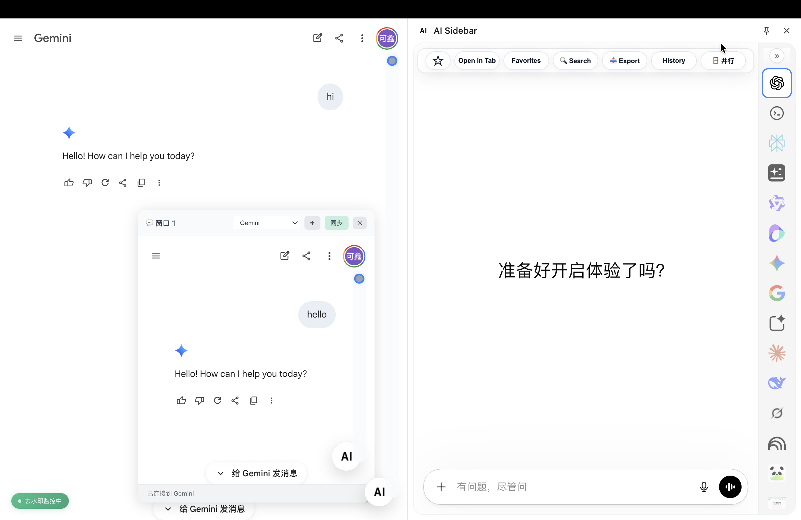

# AI Sidebar

<div align="center">
  
  <p><strong>AI Sidebar turns any AI website into a faster, more organized workspace.</strong></p>
  <p>Keep the original page in view while searching, saving favorites, exporting content, revisiting history, and switching between tools in one sidebar.</p>
  <p>AI Sidebar 将任意 AI 网站升级为更高效、更有条理的工作空间，让你在保留原页面的同时，通过侧边栏完成搜索、收藏、导出、历史查看与工具切换。</p>
</div>



## Overview

AI Sidebar 是一个基于 Chrome Side Panel 的浏览器扩展。它把 ChatGPT、Claude、Gemini、Perplexity、DeepSeek、NotebookLM 以及多种中文 AI 服务统一到一个侧边栏工作区里，并提供 URL 同步、历史记录、收藏、快捷切换、导出和部分页面增强能力。

这个仓库现在面向开源使用做了清理：
- 保留扩展主体源码、资源和必要文档
- 移除了本地记忆、对话归档和用户备份数据
- 将本地私有目录加入 `.gitignore`

## Core Features

- 多提供商侧边栏切换
- `Tab` / `Shift+Tab` 快速轮换 provider
- `Open in Tab`、历史记录、收藏、导出
- 本地优先的数据存储
- 可选本地同步服务，默认地址 `http://localhost:3456`
- 集成额外工具页面，例如 Attention Tracker

## Tech Stack

- Manifest V3
- Vanilla JavaScript
- Chrome Extension APIs
- Declarative Net Request
- IndexedDB / Chrome Storage

## Repository Layout

```text
AI-Sideabr/
├── manifest.json
├── index.html
├── css/
├── js/
├── content-scripts/
├── images/
├── history/
├── rules/
├── vendor/
├── sync/
├── docs/
└── scripts/
```

主要目录说明：
- `js/`：侧边栏 UI、provider 配置、历史记录、自动同步等核心逻辑
- `content-scripts/`：注入到目标站点的增强脚本
- `vendor/`：随扩展打包的附加工具或第三方集成代码
- `rules/`：DNR 规则
- `sync/`：本地同步数据输出目录

## Getting Started

### 1. Install

```bash
git clone https://github.com/kexin94yyds/AI-Sideabr.git
cd AI-Sideabr
npm install
```

### 2. Load the extension

1. 打开 `chrome://extensions/`
2. 开启“开发者模式”
3. 点击“加载已解压的扩展程序”
4. 选择当前仓库目录

### 3. Optional local sync

```bash
npm run sync
```

默认会启动本地同步服务，监听 `http://localhost:3456`。

更多说明：
- [QUICK_START_SYNC.md](./docs/QUICK_START_SYNC.md)
- [SYNC_GUIDE.md](./docs/SYNC_GUIDE.md)
- [TROUBLESHOOTING.md](./docs/TROUBLESHOOTING.md)

## Build

```bash
npm run lint
npm run package:webstore
```

说明：
- `npm run lint` 会跑 ESLint
- `npm run package:webstore` 会生成 Web Store 上传包

## Permissions

| Permission | Purpose |
| --- | --- |
| `sidePanel` | 在浏览器侧边栏中挂载扩展 UI |
| `tabs` | 查询和打开标签页 |
| `storage` | 保存偏好、历史和收藏 |
| `cookies` | 读取支持站点的登录态 |
| `identity` | 某些登录流程 |
| `scripting` | 动态注入脚本 |
| `declarativeNetRequest` | 调整嵌入相关请求头 |

## Privacy

核心扩展能力以本地处理为主。可选同步功能只会把数据发往用户自己机器上的本地服务。隐私政策见 [PRIVACY_POLICY.md](./PRIVACY_POLICY.md)。

## License

[MIT](./LICENSE)
